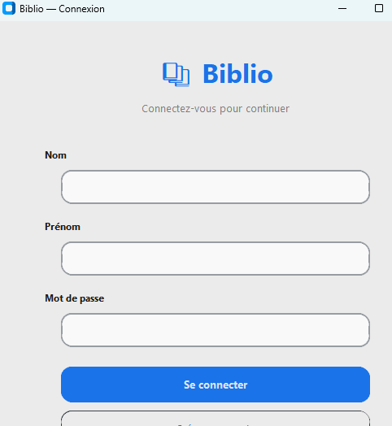
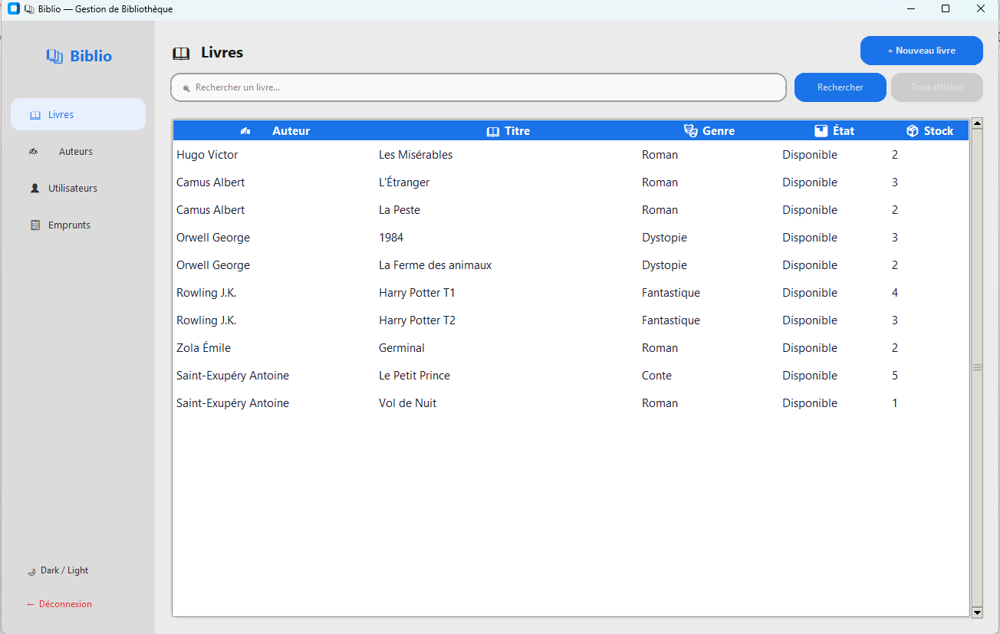
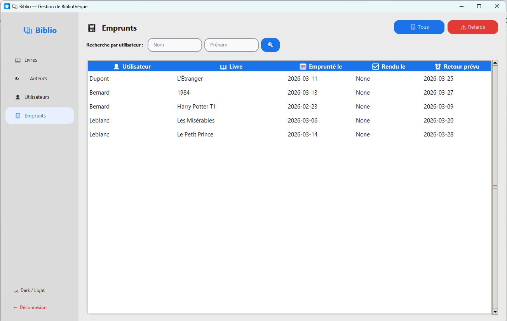
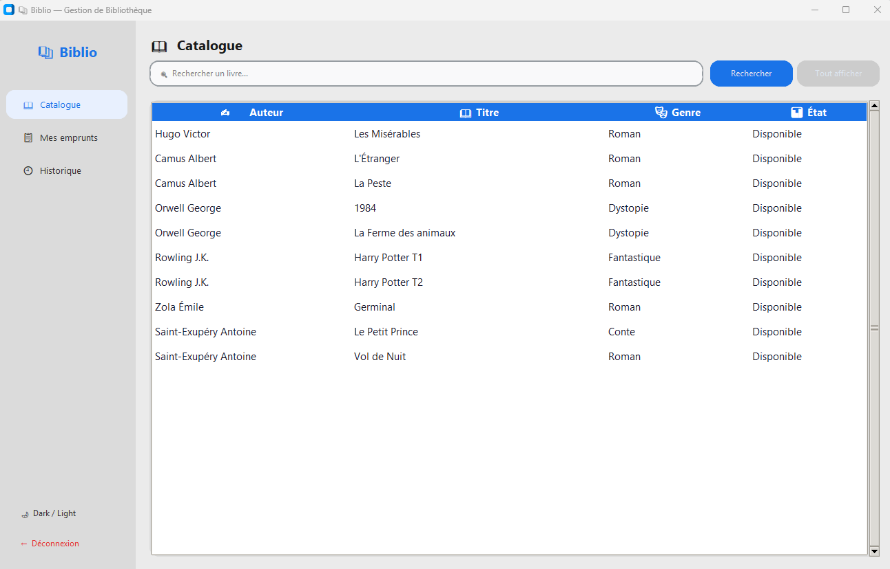

# 📚 Biblio — Application de Gestion de Bibliothèque

> Application moderne de gestion de bibliothèque développée en Python avec CustomTkinter et SQLite


---

## 📖 Description

**Biblio** est une application complète de gestion de bibliothèque permettant de gérer efficacement un catalogue de livres, des auteurs, des utilisateurs et des emprunts. Conçue avec une interface moderne et intuitive grâce à CustomTkinter, elle offre une expérience utilisateur fluide et professionnelle.

### ✨ Points forts

- 🎨 **Interface moderne** : Sidebar de navigation, dark/light mode, design épuré avec CustomTkinter
- 🏗️ **Architecture MVC** : Code structuré en 4 couches (GUI → Contrôleur → SQL → Modèle)
- 🔒 **Authentification sécurisée** : Sessions, contrôle d'accès par rôle (admin/user), mots de passe hachés SHA-256
- 📊 **Gestion intelligente** : Validation automatique, gestion du stock, détection des retards
- 🔍 **Recherche avancée** : Filtrage et recherche multi-critères

---

## 📸 Captures d'écran

### Connexion


### Interface admin — Livres


### Interface admin — Emprunts


### Interface utilisateur — Catalogue


---

## 🚀 Fonctionnalités

### ✅ Fonctionnalités implémentées

#### 🔐 Authentification & Accès
- ✓ Connexion sécurisée (mots de passe hachés SHA-256)
- ✓ Création de compte utilisateur
- ✓ Contrôle d'accès par rôle (admin / user)
- ✓ Déconnexion avec réinitialisation de session
- ✓ Interface différenciée selon le rôle connecté

#### 📚 Gestion des Livres
- ✓ Ajout de livres avec gestion automatique des auteurs
- ✓ Modification des informations (titre, date, genre, état, stock)
- ✓ Suppression sécurisée avec confirmation
- ✓ Recherche par titre
- ✓ Affichage détaillé avec menu contextuel
- ✓ Gestion automatique du stock lors des emprunts/retours

#### ✍️ Gestion des Auteurs
- ✓ Ajout d'auteurs (nom, année de naissance, nationalité)
- ✓ Création automatique lors de l'ajout d'un livre
- ✓ Suppression (bloquée si l'auteur a des livres)
- ✓ Liste complète avec recherche

#### 👤 Gestion des Utilisateurs
- ✓ Création de comptes avec validation
- ✓ Modification et suppression sécurisée
- ✓ Limitation à 3 emprunts simultanés par utilisateur

#### 📋 Gestion des Emprunts
- ✓ Affichage des emprunts en cours
- ✓ Historique complet par utilisateur
- ✓ Détection automatique des retards (coloration rouge)
- ✓ Recherche d'emprunts par utilisateur
- ✓ Calcul automatique de la date de retour (+14 jours)
- ✓ Gestion automatique du stock (décrémentation/incrémentation)
- ✓ Blocage des emprunts si utilisateur en retard
- ✓ Affichage des détails utilisateur (quota d'emprunts)

### 🚧 En cours de développement

- ⏳ Validation des retours depuis l'interface admin
- ⏳ Formulaire de création d'emprunt côté admin
- ⏳ Système de réservations
- ⏳ Export des données (PDF, Excel)
- ⏳ Statistiques et tableaux de bord analytiques

---

## 🛠️ Technologies utilisées

| Technologie | Version | Usage |
|-------------|---------|-------|
| **Python** | 3.10+ | Langage principal |
| **CustomTkinter** | 5.2.0 | Interface graphique moderne |
| **SQLite3** | 3.x | Base de données locale |
| **Hashlib** | stdlib | Hachage des mots de passe (SHA-256) |
| **Datetime** | stdlib | Gestion des dates d'emprunt |

---

## 📁 Structure du projet

```
biblio-app/
│
├── GUI_Biblio.py              # Interface graphique (Vue)
├── controleurBiblio.py        # Logique métier (Contrôleur)
├── script_sql_biblio.py       # Requêtes SQL (Modèle)
├── Biblio_model.py            # Gestion base de données
├── populate_biblio.py         # Script de données de test
│
├── screenshots/               # Captures d'écran
│   ├── login.png
│   ├── livres_admin.png
│   ├── emprunts.png
│   └── catalogue_user.png
│
├── README.md
└── .gitignore
```

---

## 📊 Schéma de la base de données

```
┌─────────────┐         ┌─────────────┐         ┌──────────────┐
│   Auteur    │         │    Livre    │         │ Utilisateur  │
├─────────────┤         ├─────────────┤         ├──────────────┤
│ id          │◄────┐   │ id          │    ┌───►│ id           │
│ nom         │     └───│ auteur_id   │    │    │ nom          │
│ date_naiss. │         │ titre       │    │    │ prenom       │
│ nationalite │         │ date        │    │    │ adresse      │
└─────────────┘         │ genre       │    │    │ mdp (hash)   │
                        │ etat        │    │    │ status       │
                        │ nbre_exempl.│    │    └──────────────┘
                        └──────┬──────┘    │
                               │           │
                               ▼           ▼
                        ┌──────────────────────┐
                        │       Emprunt        │
                        ├──────────────────────┤
                        │ id                   │
                        │ livre_id (FK)        │
                        │ utilisateur_id (FK)  │
                        │ date_emprunt         │
                        │ date_retour_prevue   │
                        │ date_retour_effective│
                        └──────────────────────┘
```

---

## 🚀 Installation

### Prérequis

- Python 3.10 ou supérieur
- pip (gestionnaire de paquets Python)

### Installation

```bash
# Cloner le repository
git clone https://github.com/Loic-Tegofack/biblio-app.git
cd biblio-app

# Installer CustomTkinter
pip install customtkinter

# Peupler la base de données avec des données de test
python populate_biblio.py

# Lancer l'application
python GUI_Biblio.py
```

### Comptes disponibles après le populate

| Rôle | Nom | Prénom | Mot de passe | Scénario de test |
|------|-----|--------|--------------|-----------------|
| Admin | Admin | Super | admin123 | Accès complet |
| User | Martin | Alice | alice123 | Peut emprunter librement |
| User | Dupont | Thomas | thomas123 | 1 emprunt en cours |
| User | Bernard | Sophie | sophie123 | 1 emprunt en retard → bloquée |
| User | Leblanc | Marc | marc123 | Quota de 3 atteint → bloqué |

---

## ▶️ Utilisation

### Navigation

L'application utilise une **sidebar verticale** pour naviguer entre les sections.
Le bouton **🌙 Dark / Light** en bas de la sidebar bascule le thème.

### Ajouter un livre

1. Section **Livres** → clic sur **"+ Nouveau livre"**
2. Remplir les champs obligatoires (Titre *, Auteur *, État *)
3. Si l'auteur n'existe pas, il sera créé automatiquement
4. Valider

### Consulter les emprunts en retard

1. Section **Emprunts**
2. Cliquer sur **"⚠️ Retards"**
3. Les emprunts en retard s'affichent avec coloration rouge

---

## 🔧 Configuration

**Durée d'emprunt** — dans `controleurBiblio.py`, classe `Borrow_Manager` :
```python
date_retour_prevue = date_emprunt + timedelta(days=14)  # modifier ici
```

**Limite d'emprunts simultanés** — même fichier :
```python
if cota > 2:  # > 2 = limite à 3, modifier selon besoin
```

---

## 🗺️ Roadmap

### Version 1.0 — En cours
- [x] Architecture MVC en 4 couches
- [x] CRUD Livres, Auteurs, Utilisateurs
- [x] Authentification et gestion des rôles
- [x] Interface admin et interface utilisateur différenciées
- [x] Gestion complète des emprunts avec règles métier
- [x] Historique des emprunts par utilisateur
- [x] Dark / light mode + sidebar de navigation
- [ ] Validation des retours depuis l'interface admin
- [ ] Formulaire de création d'emprunt côté admin

### Version 2.0 — Planifiée
- [ ] Système de réservations
- [ ] Prolongation d'emprunts
- [ ] Export PDF / Excel des emprunts

### Version 3.0 — Future
- [ ] Dashboard analytique (pandas + matplotlib)
- [ ] Statistiques avancées : livres les plus empruntés, taux de retard, activité mensuelle
- [ ] API REST pour intégration externe

---

## 🏗️ Architecture & Concepts appliqués

Ce projet a été l'occasion de pratiquer en profondeur :

- **Architecture MVC** — séparation stricte des responsabilités en 4 couches
- **Principes DRY et SRP** — helpers réutilisables, une responsabilité par fonction
- **Héritage Python** — hiérarchie `Controlleur` → managers spécialisés
- **Gestion de session** — variable de classe partagée, réinitialisation à la déconnexion
- **Transactions SQL** — intégrité des données lors des emprunts/retours
- **Pattern de navigation GUI** — `pack_forget()` / `pack()` pour les vues multiples
- **Lambda et closures** — capture de valeur dans les boucles de création de boutons

---

## 📝 Objectifs pédagogiques

Ce projet a été développé dans un cadre d'apprentissage autonome pour :

- ✅ Maîtriser l'architecture MVC en Python
- ✅ Apprendre la gestion de bases de données SQLite
- ✅ Créer des interfaces graphiques modernes avec CustomTkinter
- ✅ Implémenter la validation, la gestion d'erreurs et la sécurité
- ✅ Pratiquer Git et GitHub
- ✅ Développer une application complète de A à Z

> *Prochaine étape : analyse des données d'emprunts avec pandas et visualisation matplotlib — transformer ce projet en portfolio data analyst.*

---

## 👨‍💻 Auteur

**Loïc Tegofack**

- GitHub : [@Loic-Tegofack](https://github.com/Loic-Tegofack)
- Projet : [biblio-app](https://github.com/Loic-Tegofack/biblio-app)

---

## 🤝 Contributions

Les contributions sont les bienvenues !

1. Fork le projet
2. Créer une branche (`git checkout -b feature/amelioration`)
3. Commit (`git commit -m 'feat: ajout fonctionnalité X'`)
4. Push (`git push origin feature/amelioration`)
5. Ouvrir une Pull Request

---

## 📄 Licence

Ce projet est développé à des fins pédagogiques et d'apprentissage.

---

**⭐ Si ce projet vous a aidé, n'hésitez pas à lui donner une étoile sur GitHub !**
